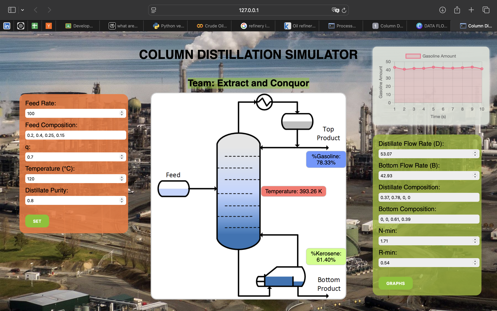
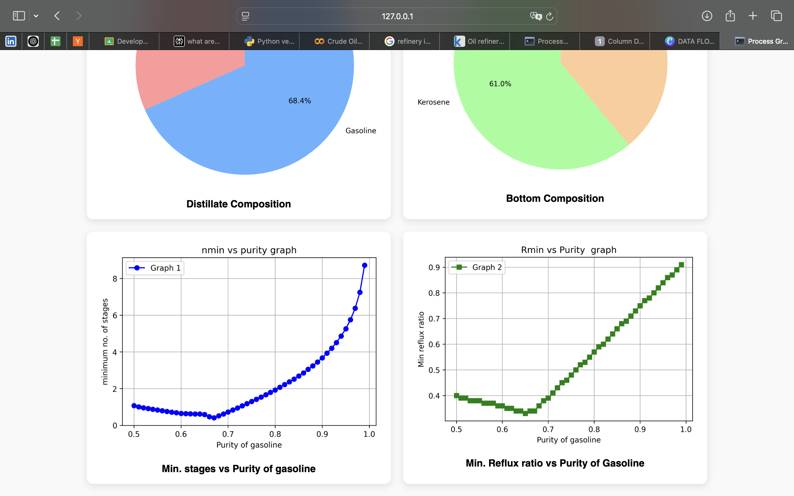

# 🧪 Column Distillation Simulator

An interactive web-based simulator for modeling binary/multicomponent distillation columns, developed by Team **Extract and Conquor**.

---

## 🧠 Overview

This project simulates a distillation column's behavior in real-time, using mass balance equations and theoretical stage analysis to compute distillate and bottom flow rates and compositions.

Built with:

- 🧮 Python (Compute Engine)
- 🔥 Flask (Backend API)
- 🌐 HTML/CSS/JS + Chart.js (Frontend UI)

---

## 📊 Data Flow Diagram

Below is a high-level overview of how data flows through the system:

  
<sup>*Data moves from user input → Flask backend → compute engine → frontend visualization*</sup>

---

## 🧪 Features

✅ Accepts feed parameters:  
• Feed rate  
• Feed composition  
• Feed quality (q-value)  
• Feed temperature

✅ Computes:
- Distillate & Bottom flow rates
- Product compositions
- Minimum number of stages *(Fenske Equation)*
- Minimum reflux ratio *(Underwood Equation)*

✅ Real-Time Visualizations:
- Gasoline content over time using Chart.js
- Live updates on a column schematic

✅ Fast and interactive UI powered by Flask and Chart.js

---

## 🚀 How It Works

1. Users input feed and purity parameters via web UI.
2. Flask server sends this data to the compute engine.
3. The engine runs rigorous mass and energy balance calculations.
4. Computed results are returned and rendered dynamically using JavaScript and Chart.js.
5. UI updates every second to simulate real-time operation.

---

## 🖥️ Screenshots

### 🔹 Main Interface



### 🔹 Graph Visualizations


---

## ⚙️ Setup

1. Clone the repository  
2. Install dependencies:

```bash
pip install -r requirements.txt
Run the server:
python app.py
```
Open your browser at:
👉 http://127.0.0.1:5000

👨‍💻 Author

Ved Pathak
Chemical Engineering, IIT Indore
✉️ che230008037@iiti.ac.in

⭐️ Future Scope
Simulations for other processes
